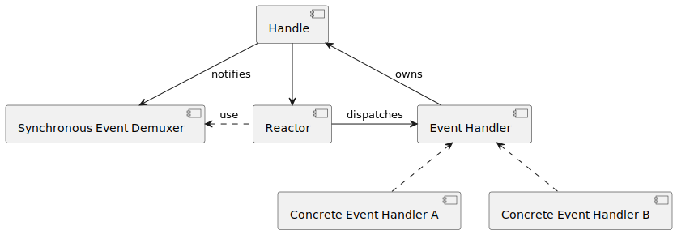

# Reactor

* Concurrent Architecture Pattern

* An event-driven framework to demultiplex and dispatch service requests concurrently onto various service providers.

## Summary

* For each supported service type implement an event handler that fulfils the specific client request.

* Register this service handler within the Reactor.

* The Reactor uses an event demultiplexer to wait synchronously on all incoming events.

* When an event arrives, the Reactor is notified and dispatches it to the specific service.

## Class Diagram

## Advantages

* A clear separation of framework and application logic.

* The Reactor can be ported to various platforms, because the underlying event demultiplexing functions are widely available.

* The separation of interface and implementation enables easy adaption or extension of the services.

* Overall structure supports the concurrent execution.

## Disadvantages

* Requires an event demultiplexing system call.

* A long-running event handler can block the Reactor.

* The inversion of control makes testing and debugging more difficult.

## Examples
* <https://github.com/r4nd0m6uy/reactor_example>
* <https://github.com/mirzachi/reactor-pattern-example>
* [Patterns in C – Part 5: REACTOR](https://www.adamtornhill.com/Patterns%20in%20C%205,%20REACTOR.pdf)
* <https://github.com/adamtornhill/PatternsInC/tree/master/5_Reactor>
